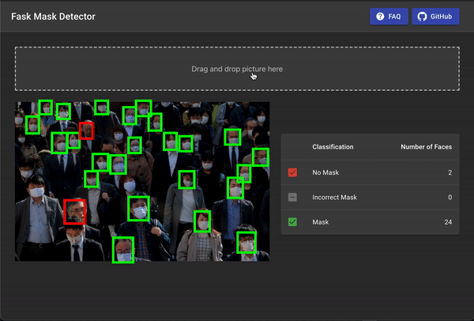

# Spr21 CS121 Face Mask Classifier
For our CS121 Software Development course at Harvey mudd College, we completed a face mask classifier. Given an input image, our [web app](https://cs121-mask-detection.netlify.app/) detects the faces in an image and classifies each face based on whether that person is wearing a mask.

### About
[Face Mask Classifier](https://cs121-mask-detection.netlify.app/) is a web app that classifies images. Given the current COVID-19 pandemic, we hope our web application can help COVID-19 researchers collecting data about mask-wearing trends, along with business owners or others who are attempting to enforce mask-wearing mandates.

Our algorithm categories each person in an image into one of two categories: wearing a mask, or not wearing a mask. The web app uses [OpenCV](https://opencv.org/) to perform face detection. Then, our model passes each detected face into a [ResNet-34 convulusional neural network](https://www.kaggle.com/pytorch/resnet34) we trained ourselves to classify it as wearing a mask or not wearing a mask.

### Using our Web App

Upon visiting our [web application](https://cs121-mask-detection.netlify.app/), users simply choose a file to upload or drag and drop an image into the indicated area. After our application processes the image (usually, 1-2 seconds), the web app will display the image with boxes around each face that was detected. Each box will be green or red, corresponding to wearing a mask correctly or not wearing a mask, respectively. In addition, we display statistics about how many detected faces fell into each category in tabular form, which is useful for larger images.

Our web application supports a variety of screen sizes and devices, including mobile.

### Hosting
We use [Google Cloud Platform](https://cloud.google.com/) to host our [Flask back end](https://facee-309423.wl.r.appspot.com/), which includes all of our models. We use [Netlify](https://www.netlify.com/) to host our front end React application.

### Models
All deployed models can be found [here](https://github.com/Rubiks-boy/cs121-mask-detection/tree/main/app/static).

The models we use for face detection and mask classification were trained on a data set that includes images of people both wearing masks and not wearing masks.

Our face detection within OpenCV uses [this model](https://github.com/chandrikadeb7/Face-Mask-Detection/tree/master/face_detector).

We trained a ResNet-34 CNN on [this Kaggle data set](https://www.kaggle.com/andrewmvd/face-mask-detection), providing us with a [model](https://github.com/Rubiks-boy/cs121-mask-detection/blob/main/app/static/face_mask_classifier.zip) used for face classification.

### Known Bugs
- Very large images, or images with a large number of faces (i.e. several dozen) can result in timeouts.
- We hoped to implement nose detection, which would support recognizing faces with masks worn incorrectly. Unfortunately, we weren't able to implement this reliably prior to our V1 release.

### Acknowledgements
We would like to thank Professor Z Sweedyk and our grutor Carson Herness for their support throughout the development process.

### Contributors
[Xander Hirsch](https://github.com/amhirsch)
[Dylan McGarvey](https://github.com/McGarvs)
[Nick Tan](https://github.com/ntan9)
[Adam Walker](https://github.com/Rubiks-boy)